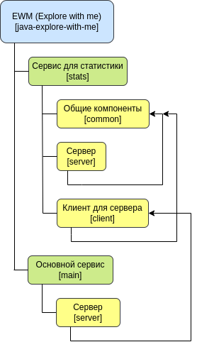

# Explore with me

> **Explore with me** - это проект, который позволяет пользователям 
> находить интересные события, а также компанию для их посещения.
> Основная идея заключается в упрощении процесса планирования досуга 
> и облегчении поиска единомышленников.

## Оглавление

- [Технический стек](#технологический-стек)
- [Архитектура проекта](#архитектура-проекта)

## Технологический стек

- Java 11
- Spring Boot 2
- ORM: Hibernate, Spring Data JPA
- Apache Maven
- Docker: dockerfile, docker-compose

## Архитектура проекта

